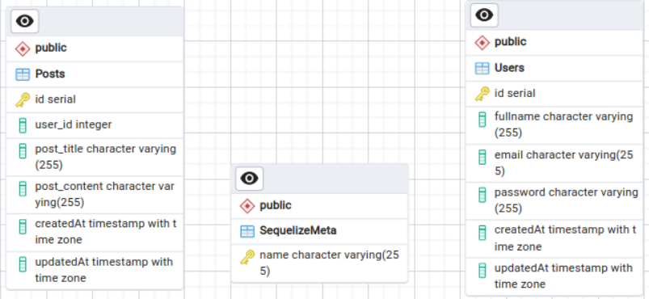

<picture>

</picture>

## Description
This is a blog website API project for UKM Software Development assignment. This project will work on handling requests for managing users and posts data.
Credits by Aldino Erlangga Desiariyanto

## Database Design
<picture>

</picture>

## Dependencies
- [ExpressJS](https://expressjs.com/)
- [Sequilize](https://sequelize.org/)
- [PostgreSQL](https://www.npmjs.com/package/pg)
# Tutorial Github
## How to Clonning Repository
1. On your computer, open Command Prompt or Terminal
2. Copy and then paste command below into your computer
`git clone https://github.com/aldinoed/infoin.git`
3. Open the project by entering the project folder and then open in your code editor
## How to Use and Configuration Node JS Express
1. Download and install [Node Package Manager](https://nodejs.org/en/download)
2. Install all original dependencies from the project by typing the command below:
`npm install`
3. Make an empty database named ***infoin*** in PostgreSQL.
4. Open the config.json located at config directory and then edit the database connection depend with your existed database.
5. Run the command below in your Command Prompt or Terminal to migrate the migrations in it into existing database named infoin:
`npx sequelize-cli db:migrate`